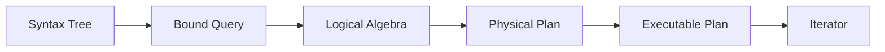

# Query Pipeline

The NQuery query pipeline transforms source text into an executable plan through five consecutive phases:



Each phase produces an intermediate representation consumed by the next. The pipeline is invoked from `Compilation.Compile()`.

The entry point is the `Compilation` class, which holds a `DataContext` and a `SyntaxTree`:

```csharp
public static Compilation Create(DataContext dataContext, SyntaxTree syntaxTree);
public CompiledQuery Compile();
```

Internally, `Compile()` chains five stages:

1. [**Binding**](query-pipeline/binding.md) — resolves identifiers against the `DataContext`
2. [**Algebrization**](query-pipeline/algebrization.md) — lowers bound queries to logical algebra
3. [**Optimization**](query-pipeline/optimization.md) — applies rule-based transforms
4. [**Planner**](query-pipeline/planner.md) — converts logical to physical operators
5. [**Emit**](query-pipeline/executable.md) — compiles physical plan to executable form

The result is a `CompiledQuery` wrapping an `ExecutablePlan`. Calling `CompiledQuery.CreateIterator()` produces a runtime [**Iterator**](query-pipeline/iterators.md) that yields result rows.

## Stage Details

- [**Lexing and Parsing**](query-pipeline/lexing-parsing.md) — tokenization and syntax tree construction
- [**Binding**](query-pipeline/binding.md) — name resolution and type checking
- [**Algebrization**](query-pipeline/algebrization.md) — logical relational algebra
- [**Optimization**](query-pipeline/optimization.md) — passes and batching strategy
- [**Planner**](query-pipeline/planner.md) — physical operator selection
- [**Executable (Emit)**](query-pipeline/executable.md) — code generation
- [**Iterators**](query-pipeline/iterators.md) — runtime execution engines
